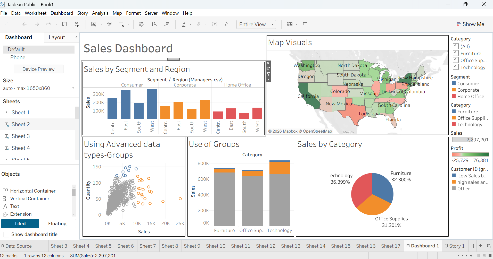

# Superstore Sales Performance Dashboard

This project presents an interactive Tableau dashboard built using the Superstore dataset. It focuses on analyzing sales, profit, and regional performance to derive meaningful business insights.

## View Interactive Dashboard
🔗 https://your-tableau-link-here
https://public.tableau.com/app/profile/athrva.sharma/viz/AthrvaSharmaSuperstoreSalesPerformanceStorywithdashboard/Story1?publish=yes

## Dashboard Preview

## About the Project

I built this dashboard to explore how different regions, product categories, and time periods affect overall business performance. The goal was to keep the analysis simple and easy to understand.

---

## Tools Used

- Tableau  
- CSV datasets  

---

## Project Structure

- `data/` → CSV files  
- `images/` → dashboard screenshot  
- `Workbook.twbx` → Tableau workbook  

---

## Author

Athrva Sharma  

This project was independently designed and developed as part of my data analytics practice but used online course for guidance and learning.

---

## Note

The dashboard is interactive. You can apply filters and explore the story for deeper insights.
